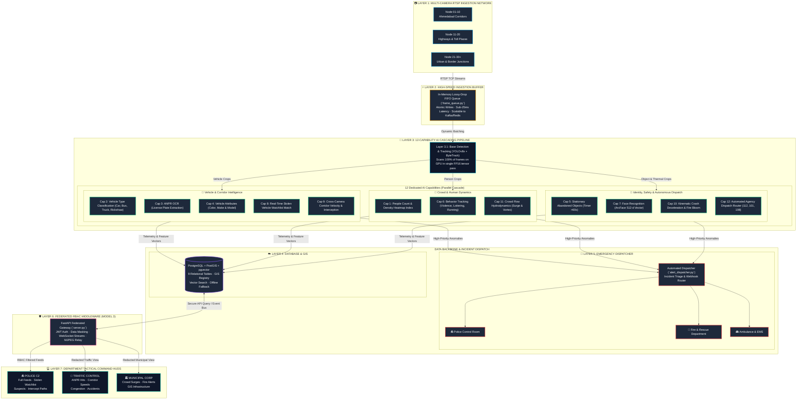
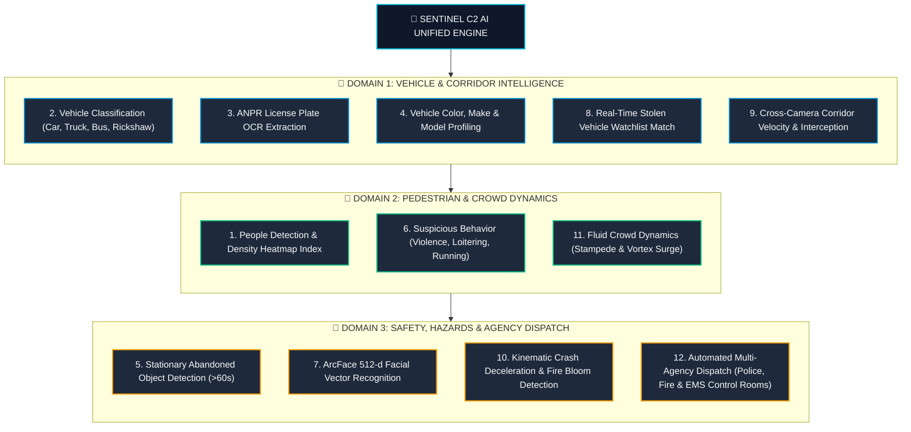
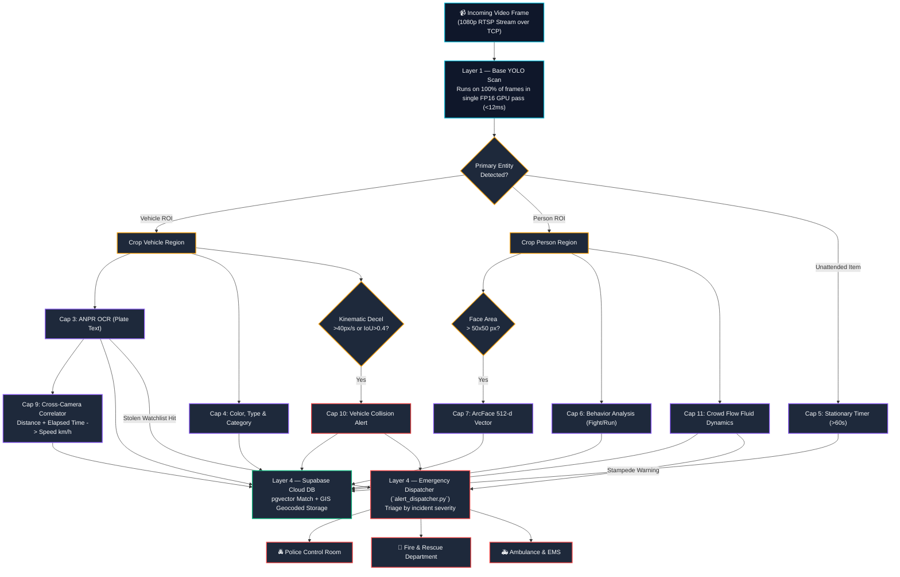
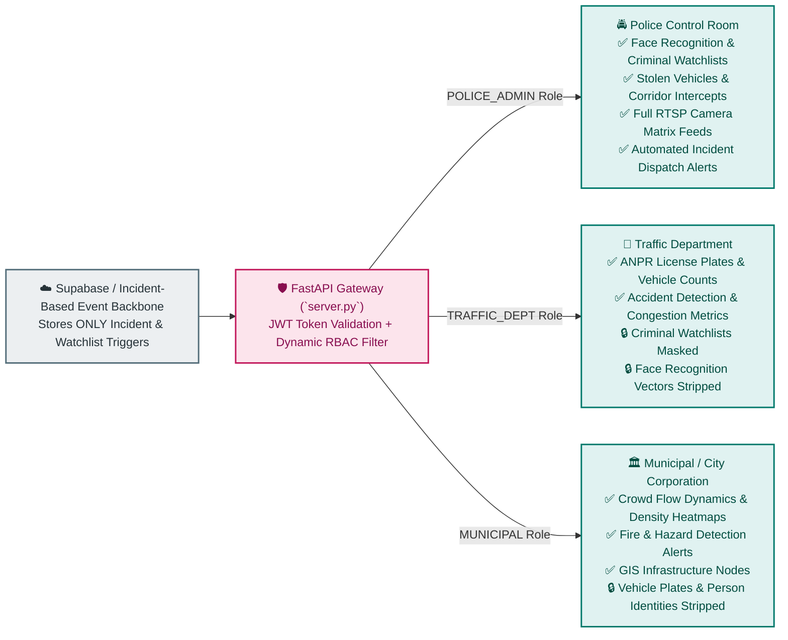
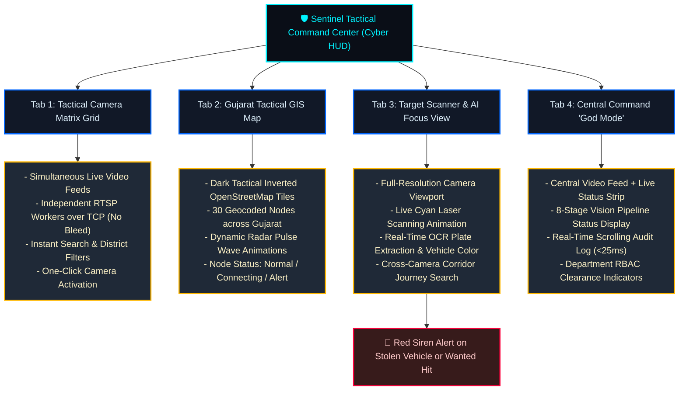

# Sentinel Vision AI — System Architecture
### Gujarat Hackathon Submission | Hybrid Model 2 + Model 3

---

## Overview

Sentinel Vision AI is a hybrid AI-powered CCTV surveillance platform that unifies video feeds from multiple departmental systems into a single intelligent engine, while simultaneously enforcing federated, role-based access for downstream government departments.

It implements **Model 2 (Unified Viewing & Metadata Analytics)** and **Model 3 (VMS Federation & Middleware Integration)** as a combined hybrid approach, enhanced with **cross-camera vehicle corridor tracking**, **accident & hazard detection**, **fluid-dynamic crowd flow analytics**, and **automated multi-agency emergency dispatch (Police, Fire, Ambulance)**.

---

## Master System Architecture

---

## One Engine, 12 Core Capabilities

---

## 4-Layer AI Cascade Execution Flow

The system executes in a **hierarchical cascade** to eliminate unnecessary computation. Higher-level neural networks only run if the primary pass detects target regions of interest:

---

## Automated Multi-Agency Emergency Dispatch Matrix

When an anomaly or watchlist hit is confirmed, the **Emergency Dispatcher** (`alert_dispatcher.py`) triages the event based on incident taxonomy and issues real-time webhooks with geocoded metadata:

| Incident Category | Detection Mechanism | Primary Agency | Secondary Agency | Automated Payload Dispatched |
|---|---|---|---|---|
| **Stolen Vehicle Identified** | ANPR OCR + `watchlist_vehicles` lookup | 🚔 **Police Control Room** | 🚦 Traffic Dept | Camera ID, Geolocation, Plate Number, Vehicle Color, Corridor Heading, Timestamp |
| **High-Speed Vehicle Collision** | Kinematic abrupt deceleration + bbox IoU overlap | 🚑 **Ambulance & EMS** | 🚔 Police Control Room | Collision GPS, Estimated Speed at Impact, Camera Snapshot URL, Lanes Blocked |
| **Fire / Smoke Hazard** | Chromatic flame bloom + stationary thermal rise | 🚒 **Fire & Rescue Dept** | 🚔 Police Control Room | Thermal Coordinates, Hazard Footprint ($m^2$), Camera Node GPS, Timestamp |
| **Crowd Stampede / Panic Surge** | Fluid flow alignment ($\phi > 0.85$) + sudden acceleration | 🚔 **Police Control Room** | 🚑 Ambulance & EMS | Density Index ($\text{ppl}/m^2$), Exit Bottleneck Vector, Evacuation Routing |
| **Criminal / Wanted Suspect Hit** | ArcFace 512-d embedding match (cosine dist $< 0.35$) | 🚔 **Police Special Cell** | — | Suspect ID, Confidence Score, Camera Node GPS, Timestamp |
| **Hit-and-Run Evasion** | Crash detected + Vehicle observed exiting frame | 🚔 **Police Control Room** | 🚦 Traffic Dept | Fleeing Plate Number, Next Intercept Camera, Velocity Estimate (km/h) |

---

## Cross-Camera Correlation & Corridor Tracking Architecture

The **Cross-Camera Vehicle Tracker** (`cross_camera.py`) tracks vehicles across disjoint camera zones **without requiring second-stage GPU vision passes**, achieving microsecond-level query speeds:

1. **Spatial Geocoding**: Each camera node has calibrated coordinates $(\text{lat}_1, \text{lon}_1)$ and $(\text{lat}_2, \text{lon}_2)$.
2. **Haversine Distance**:
   $$\Delta \sigma = 2 \arcsin \sqrt{\sin^2\left(\frac{\Delta \text{lat}}{2}\right) + \cos(\text{lat}_1)\cos(\text{lat}_2)\sin^2\left(\frac{\Delta \text{lon}}{2}\right)}$$
   $$d = R \cdot \Delta \sigma \quad (\text{where } R = 6371 \text{ km})$$
3. **Corridor Velocity & Interception**:
   $$v_{\text{est}} = \frac{d}{\Delta t} \times 3600 \quad (\text{km/h})$$
   If $v_{\text{est}} \le 140\text{ km/h}$ and $d \le 25\text{ km}$, the sighting is correlated as a confirmed journey corridor. The system automatically computes the **nearest downstream camera node** to suggest physical interception checkpoints for law enforcement.

---

## Hardware Sizing & Scalability Calculations

The following table provides hardware sizing and throughput calculations across three deployment scales: **30 Cameras** (Hackathon Pilot), **50 Cameras** (District Urban Hub), and **80,000 Cameras** (Statewide Gujarat Safe City Command):

| System Parameter | 30 Cameras (Current Pilot) | 50 Cameras (District Hub) | 80,000 Cameras (Statewide Gujarat Grid) |
|---|---|---|---|
| **Target Video Resolution** | 1080p @ 25 FPS (H.264/H.265) | 1080p @ 25 FPS (H.264/H.265) | 1080p @ 15–25 FPS Dynamic Adaptive |
| **Aggregate Frame Ingestion Rate** | 750 FPS (1.55 GPixels/sec) | 1,250 FPS (2.59 GPixels/sec) | 1,600,000 FPS (3,317 GPixels/sec) |
| **Network Ingestion Bandwidth** | ~120 Mbps (TCP RTSP) | ~200 Mbps (TCP RTSP) | ~320 Gbps Aggregate (Edge-Aggregated) |
| **Recommended GPU Compute** | 1× NVIDIA Quadro RTX 5000 / RTX 4080 | 1× NVIDIA A100 (40GB) or 2× RTX 4090 | Distributed Cluster: ~600–800× NVIDIA L40S / A100 Nodes |
| **GPU VRAM Utilization** | ~3.4 GB / 16 GB GDDR6 | ~7.8 GB / 40 GB HBM2 | ~16–24 GB per Edge Compute Node |
| **Inference Engine Optimization** | PyTorch FP16 TensorRT Engine | TensorRT FP16 / INT8 Quantized | INT8 TensorRT + DeepStream Pipeline |
| **Host CPU Architecture** | 8 Cores / 16 Threads (x86_64) | 16 Cores / 32 Threads (AMD EPYC) | 64-Core AMD EPYC Nodes (Edge Clusters) |
| **System Host RAM** | 32 GB DDR4/DDR5 | 64 GB DDR5 | 128 GB–256 GB ECC RAM per Node |
| **Queueing Architecture** | In-Memory Lossy-Drop FIFO (`frame_queue.py`) | Redis Cluster (In-Memory Ring Buffer) | Distributed Apache Kafka (Partitioned per District) |
| **Queue Buffer Depth & Latency** | Max 120 Frames (<25ms Latency) | Max 500 Frames (<25ms Latency) | Multi-Tier Partitioned (<40ms E2E Latency) |
| **Database Architecture** | Supabase Cloud PostgreSQL + Local Fallback | PostgreSQL 16 + PostGIS + pgvector | Distributed Citus PostGIS Cluster + ScyllaDB Time-Series |
| **Database Write Throughput** | ~40–80 Transactions/sec | ~120–250 Transactions/sec | ~25,000–50,000 Batched Events/sec |
| **Vector Search Capacity (pgvector)** | 10,000 Wanted Face Embeddings | 100,000 Criminal Embeddings | 10,000,000+ Embeddings (HNSW Graph Index) |
| **Cold Video Archive Tier** | Local SSD Cache / NVMe (48 Hours) | 10 TB NVMe + 50 TB NAS | Multi-Petabyte Ceph Object Store / S3 Glacier |
| **Emergency Dispatch Latency** | < 50ms Webhook / In-Memory Broadcast | < 50ms Webhook / MQ Alert | < 100ms Guaranteed Multi-Agency SLA |

---

## Federated Role-Based Access Control (Model 3)

---

## Technology Stack

| Layer | Component | Official Suggested Tech | Sentinel Implementation |
|---|---|---|---|
| **Ingestion & Streaming** | RTSP / ONVIF / WebRTC | RTSP libraries / WebRTC / HLS relay | Concurrent StreamGrabber (`stream_grabber.py`) + Low-Latency MJPEG over TCP |
| **Messaging & Queue** | In-Memory Frame Bus | Kafka / RabbitMQ / Redis | High-Speed Frame Queue (`frame_queue.py`) with Lossy-Drop (<25ms Latency) |
| **Base AI / ML Engine** | Object Detection & Tracking | YOLOv8 / Open-source Vision Models | YOLOv8x + ByteTrack with CUDA 11.8 FP16 acceleration |
| **ANPR Subsystem** | OCR & Plate Extraction | ANPR custom/open models | EasyOCR with Grayscale Bilateral Filter + Morphological Contrast Prep |
| **Corridor Correlator** | Cross-Camera Journey Map | Spatial-temporal correlation | `CrossCameraVehicleTracker` (`cross_camera.py`) with Haversine velocity |
| **Crash & Hazard Engine** | Kinematic Crash / Fire | Motion & Thermal Analytics | `AccidentDetector` (`models/accident_detection.py`) + Hazard analyzer |
| **Crowd Flow Engine** | Crowd Density & Dynamics | Fluid-dynamics approximation | `CrowdFlowAnomalyDetector` (`models/crowd_flow.py`) CPU-only vector math |
| **Emergency Dispatch** | Multi-Agency Notification | Webhooks / Microservice Callouts | Guarded `EmergencyDispatcher` (`alert_dispatcher.py`) (Police, Fire, EMS) |
| **Database & GIS** | Event Store, Vectors & GIS | PostgreSQL + PostGIS | Supabase PostgreSQL + PostGIS GIS Registry + pgvector + Offline Fallback |
| **Middleware & Gateway** | Federated API & RBAC | Node.js / Python (FastAPI/Django) | Python FastAPI Microservices (`server.py`) + JWT Department-Wise RBAC |
| **Frontend Interface** | Multi-Dept Tactical HUD | React.js | **React 19 SPA (Vite + Tailwind CSS + Lucide Icons + JetBrains Mono)** |
| **GIS Mapping** | Tactical Map Visualization | Leaflet / OpenLayers | **Native Leaflet.js with Inverted Dark OpenStreetMap Tiles (100% Free, Zero Watermarks)** |
| **Containerization** | Production Packaging | Docker / Compose | Multi-Service Docker Compose (CUDA 11.8 Passthrough + Dev Mode Frontend) |

---

## Database Schema — 9 Tables

| # | Table | Purpose |
|---|---|---|
| 1 | `camera_locations` | GIS Registry — 30 Geocoded Gujarat Camera Nodes (Ahmedabad, Junagadh, Navsari, Rajkot, etc.) |
| 2 | `ai_events` | Central Event Backbone — Incident-based triggers, timestamps, and alert severity |
| 3 | `log_people` | Capability 1 & 11: Crowd count, density index, and fluid-flow velocity metrics |
| 4 | `log_vehicles` | Capability 2 & 4: Vehicle records (**INCIDENT-BASED ONLY** — saved if involved in a crash, violation, or anomaly) |
| 5 | `log_license_plates` | Capability 3: ANPR records (**INCIDENT-BASED ONLY** — NOT mass surveillance; logged only if speeding, stolen, or flagged) |
| 6 | `log_objects` | Capability 5: Abandoned or unattended suspicious objects with stationary timer |
| 7 | `log_activities` | Capability 6: Suspicious human behaviors (running, loitering, violent fighting) |
| 8 | `watchlist_vehicles` | Capability 8 & 9: Stolen / flagged vehicles with active APB broadcast records |
| 9 | `watchlist_faces` | Capability 7: Wanted persons and missing individuals with ArcFace 512-d embeddings |

---

## Cyber Command Interface Architecture

